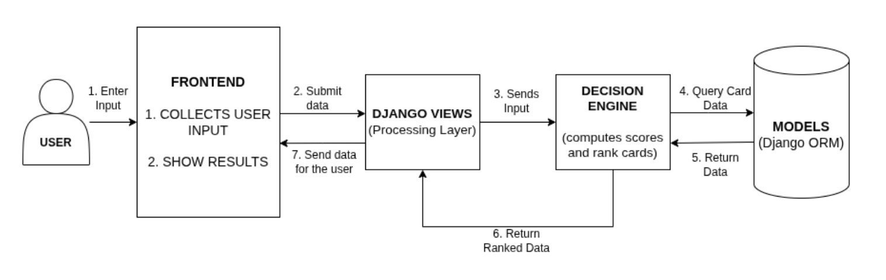

# CardAdvisor – Credit Card Decision Companion

🔗 **Live Demo:** https://cardadvisor.pythonanywhere.com

---

## Problem Understanding

Retail users often choose credit cards based on marketing or generic comparisons.  
The real value of a credit card depends on individual spending patterns, reward caps, annual fees, forex costs, and category multipliers.

**CardAdvisor** is a decision companion that:

- Accepts user spending and financial profile  
- Evaluates multiple credit cards from a structured dataset  
- Computes net annual value  
- Produces a ranked and explainable recommendation  

The system is deterministic and rule-based, not a black-box AI model.

---

## Current Scope (MVP)

Implemented:

- Django + Tailwind CSS mobile-first UI  
- Structured user input form (spend, income, fee tolerance, preferences)  
- CreditCard and RewardCategory data models  
- Real card data with reward caps and fee waiver rules  
- Decision engine (service layer) with:
  - Eligibility filtering (income, fee tolerance, forex support)  
  - Category-wise reward computation  
  - Cashback and spend cap handling  
  - Lounge value conversion  
  - Forex cost calculation  
  - Fee waiver logic  
  - Net annual value calculation  
  - Normalized multi-criteria scoring  
  - Stable tie-breaking  
- Ranked results page with top recommendation and breakdown  

---

## System Architecture

- **Frontend:** Django templates + Tailwind CSS  
- **Backend:** Django views + service-layer decision engine  
- **Data layer:** Relational models for cards and reward rules  

---

## Decision Logic

For each eligible card:

1. Compute annual rewards per category with caps  
2. Convert lounge visits to monetary value  
3. Apply forex cost only if supported  
4. Apply fee waiver based on annual spend  
5. Calculate net annual value  

A normalized composite score is also calculated using user preferences  
(cashback, lounge, low fee, low forex).  

Final ranking combines monetary value and preference score, with deterministic tie-breaking.

---

## Design Principles

- Fully explainable scoring (no hidden AI decisions)  
- Separation of constraints and scoring logic  
- Service-layer business logic (not inside views)  
- Deterministic outputs for identical inputs  
- Mobile-first responsive UI  

---

## Assumptions

- Lounge value assumed as ₹800 per visit  
- Monthly caps applied before annualization  
- Zero-fee cards treated as fee-waived  
- Forex cost applied only when the card supports international transactions  

---

## AI Usage Disclosure

AI tools were used for:

- Reviewing and refining the decision engine structure  
- Introducing normalization utilities and tie-breaking strategy  
- Claude AI was used in perfecting the front end UI
- Formatting Markdown documentation  

All domain modeling, business rules, calculations, and testing were implemented and validated manually.